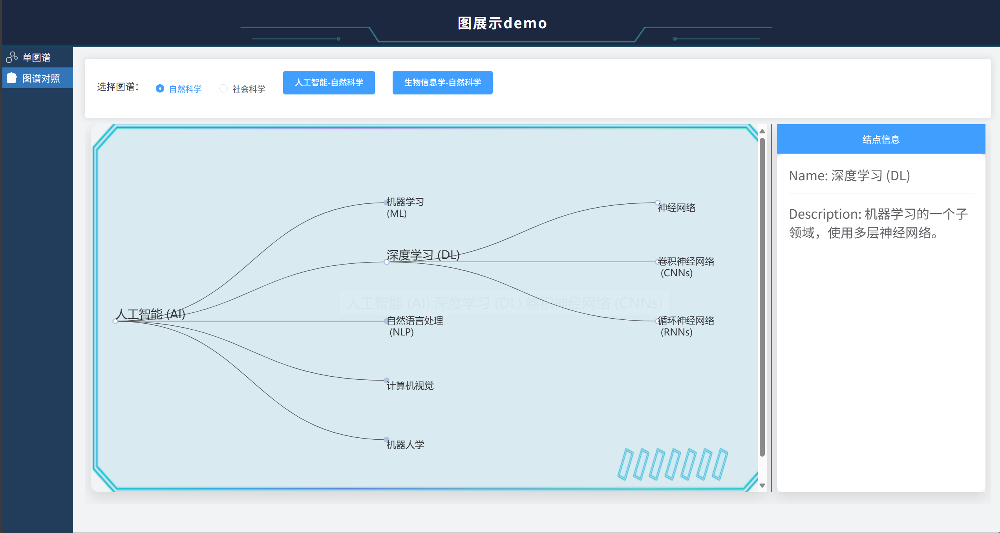

# 图谱展示组件 for NEUKG

## 项目简介
这是一个基于 Vue 3 + Vite + TypeScript 的图谱展示组件项目，支持动态加载图谱数据并进行可视化展示，适用于d3力导向图，Echarts横向树图场景。


## 🎯 项目目的

接触过项目用 D3 力导图和 ECharts 的 Tree 图，刚接触感觉是两坨难用

自发写了个 demo给组里用，希望减轻组内同学使用这两个图做可视化的的负担。这个项目抛砖引玉，希望大家用得上，提出意见和建议，或者一起折腾
---

## 功能特性

- **动态数据加载**：支持从接口或静态数据文件加载图谱信息。
- **多样化布局**：支持树状、力导向布局方式与便捷切换，节点展开保持同步。
- **多数据源切换**：便捷从切换显示并保留之前的状态（每个大类仅保留一个）
- **动态变化窗口**：力导向图和树图的画布大小随内容的增加和减少动态改变，并附有滑动条
---

## 🛠 技术栈

- [Vue 3](https://vuejs.org/) + [Composition API](https://vuejs.org/guide/extras/composition-api-faq.html)
- [Vite](https://vitejs.dev/) - 极速构建工具
- [TypeScript](https://www.typescriptlang.org/) - 类型安全
- UI 组件库: [Element UI Plus](https://element-plus.org/zh-CN/#/zh-CN)
- 图形渲染库：
    -  [D3.js](https://d3js.org/) 
    - [ECharts](https://echarts.apache.org/)
## 界面展示





## 📬 联系方式

- 维护者：李十针

## 运行

```bash
npm install
npm run dev


